# Hootaku-UX-2023-

UX study for Hootaku, an application for tracking of anime-related media.

Team 4:
- Alfredo Ávila — Designer
- César Astudillo  — Expositor
- Fernando Fernández — Designer
- Francisco Tropa — Designer

## Index

- [1. Introduction](#1-introduction)
- [2. Strategy](#2-strategy)
- [3. UX Person](#3-ux-person)
- [4. Benchmark](#4-benchmark)
- [5. Customer Journey Map](#5-customer-journey-map)
- [6. Navigation](#6-navigation)
- [7. Wireframes](#7-wireframes)
- [8. Mockups](#8-mockups)

---

## 1. Introduction

Consuming anime and manga has become a more mainstream hobby in recent years, but with the rise of the medium, finding exciting new stories andd tracking the chapters and episodes of a particular series is becoming increasingly difficult among the sea of content available.

This project is focused on automatizing this aspect of the hobby in an approachable and simplified manner.

---

## 2. Strategy

To have a more structured plan for the project, we have used a 'Value proposition canvas', so our view is focused and has a solid foundation.

In this canvas we analyze the problems our application is tackling, how we will approach said problems, and a strategical analyisis of the required functions we will need. 

---

## 3. UX Person

The application is designed for users who enjoy Japanese media as a hobby, helping them organize their shows and manga in custom libraries, marking them for future watching, and allowing them to share their opinions on them, along with reading other peoples thoughts on a given piece of media. The usage of the application benefits of using UX Persons to understand its demographic better, and provide more accurate solutions to the frustrations they may encounter.

---

## 4. Benchmark

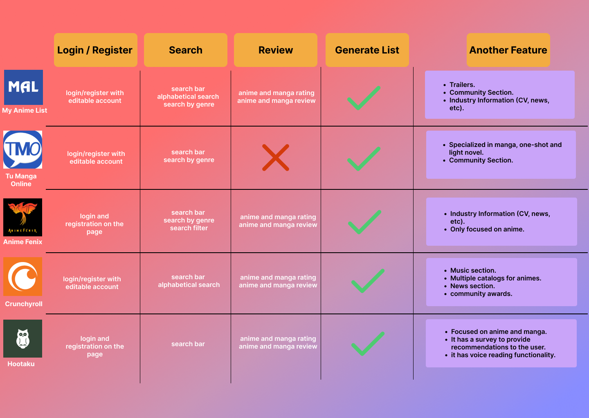

---

## 5. Customer Journey Map

 Analyzing the feelings and reactions from the user through a Customer Journey map allows us to understand what needs refinement, and bring a better experience to the users in every step of usage in the application.

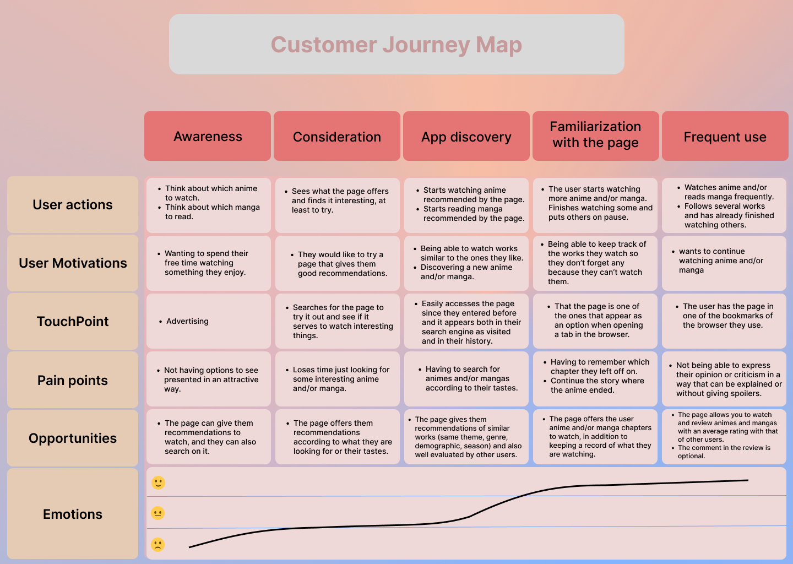

---

## 6. Navigation

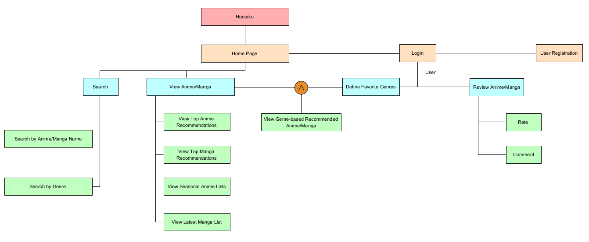

---

## 7. Wireframes

Landing page 
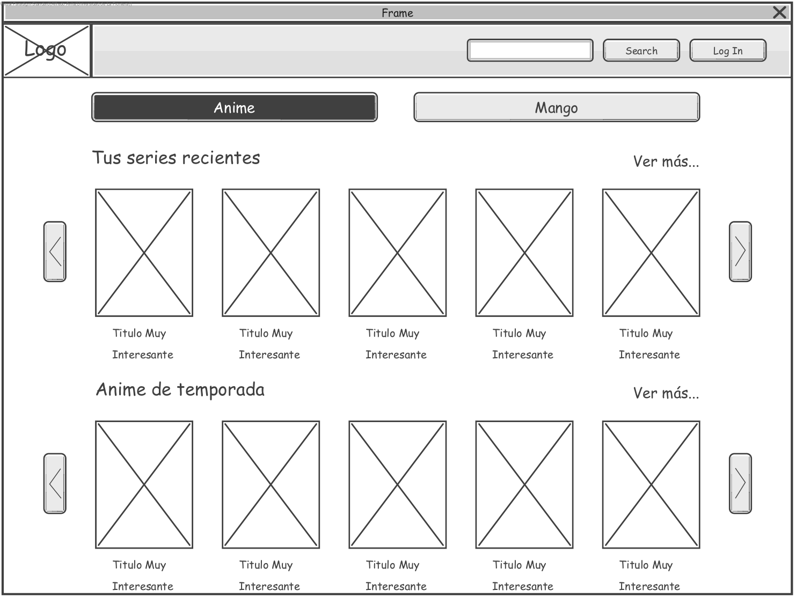

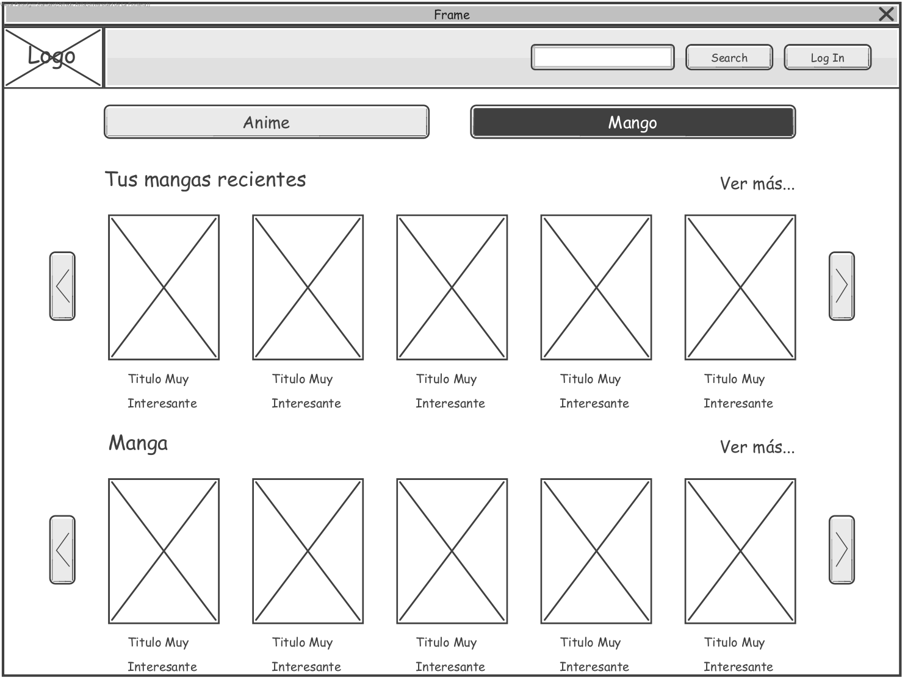

Search results
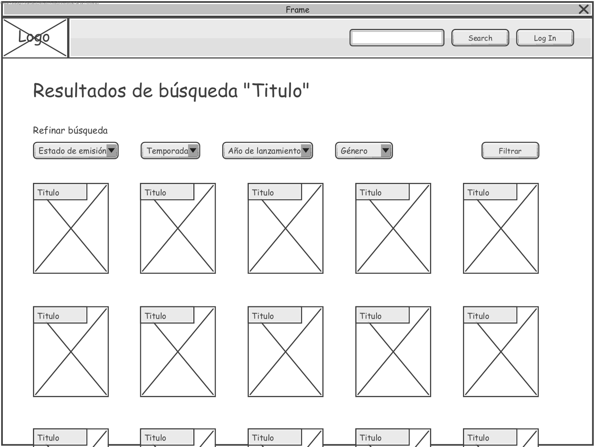

Detailed view
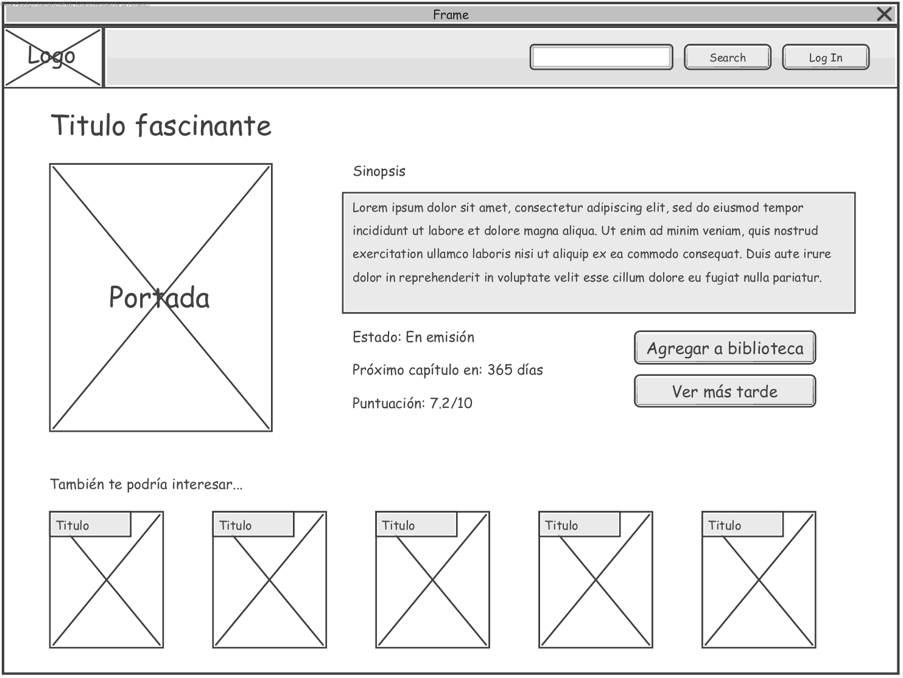

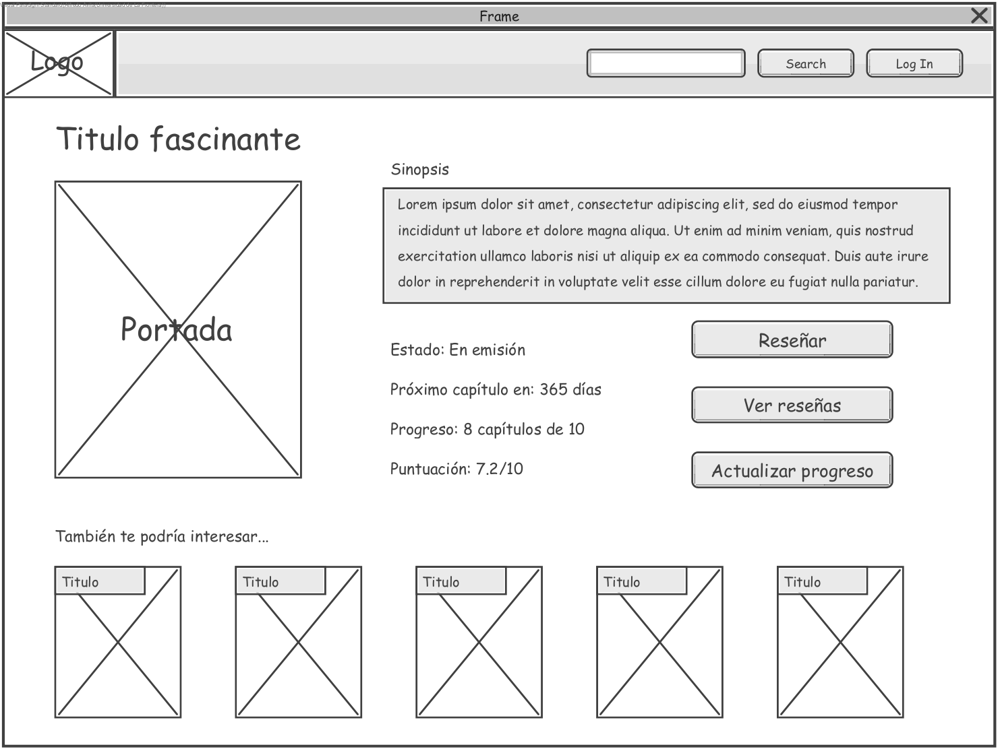

User profile

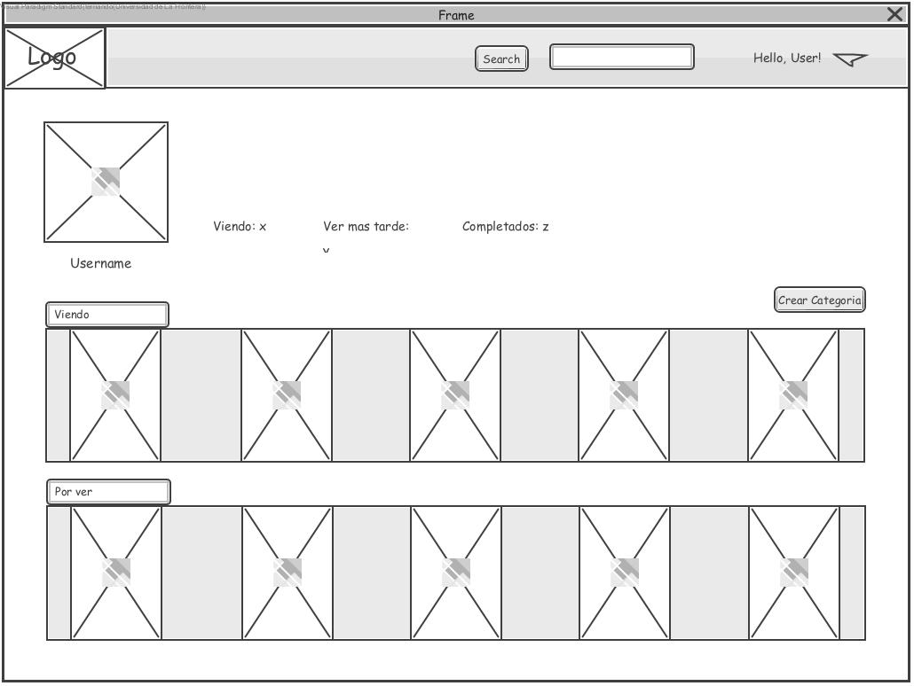

---

## 8. Mockups

Logged in landing page/Home page
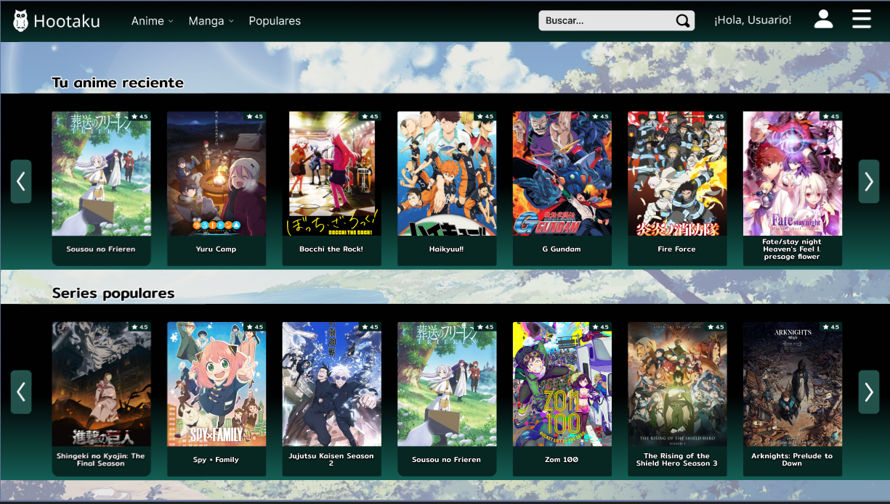

Anime detail view
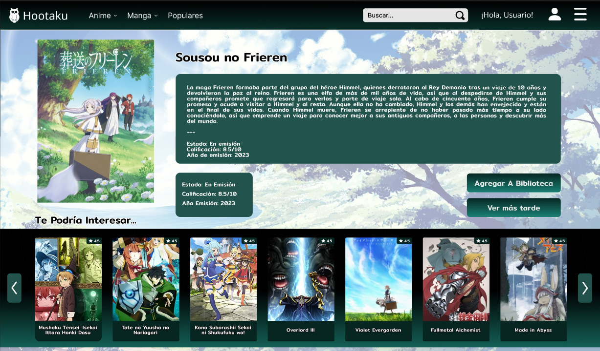

User profile
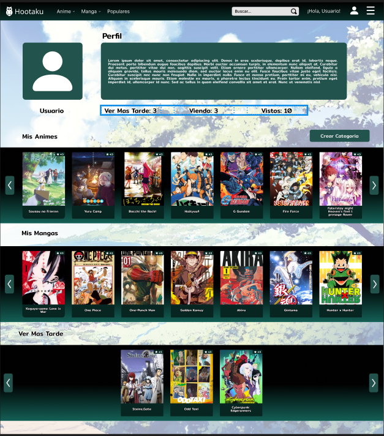

---
