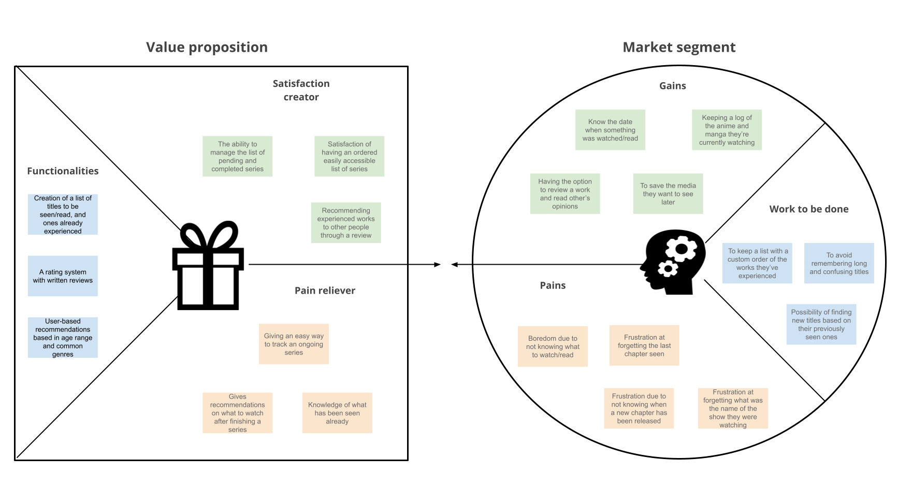
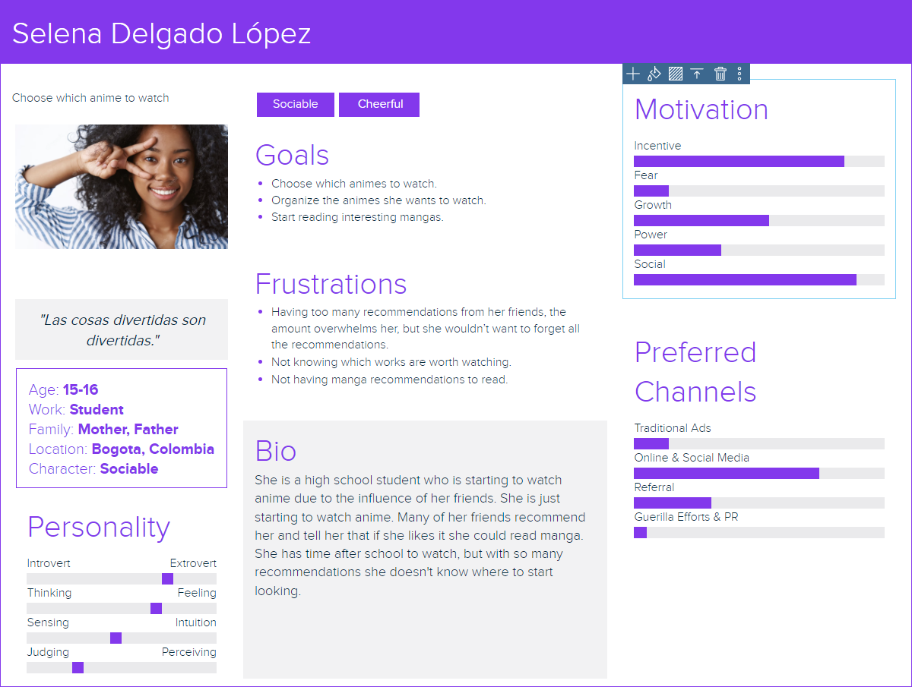
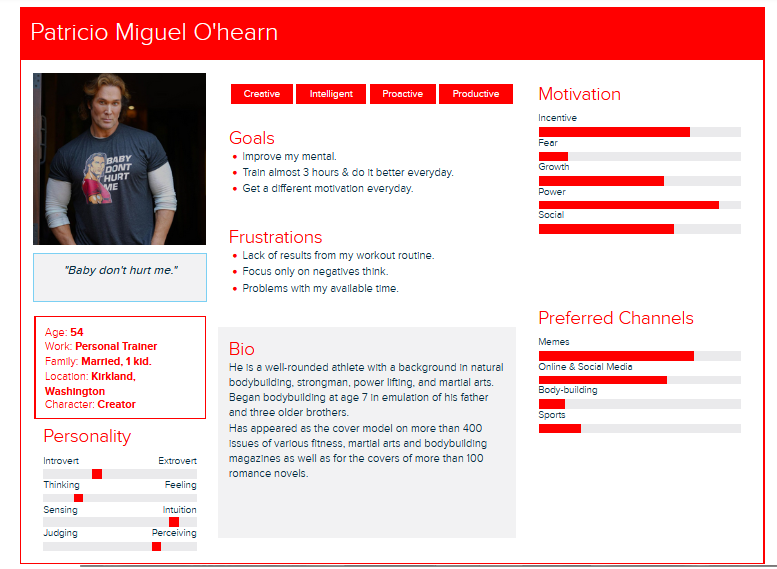
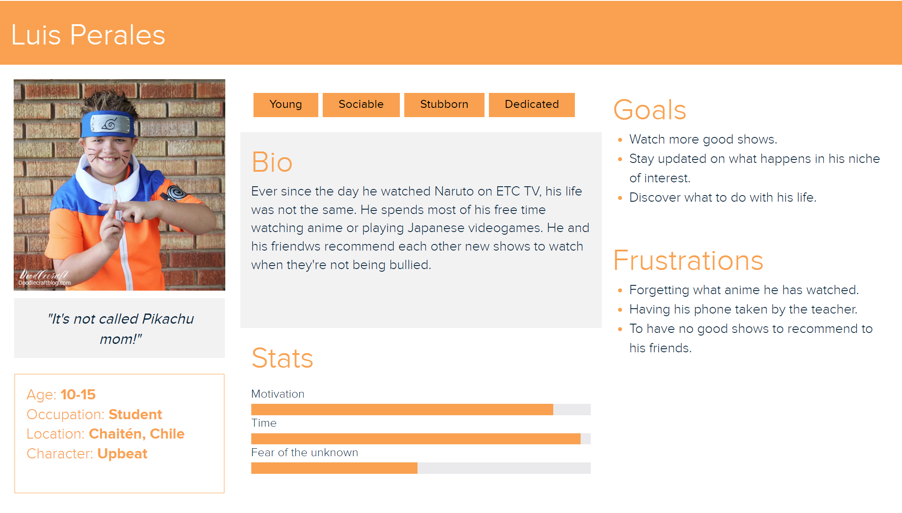
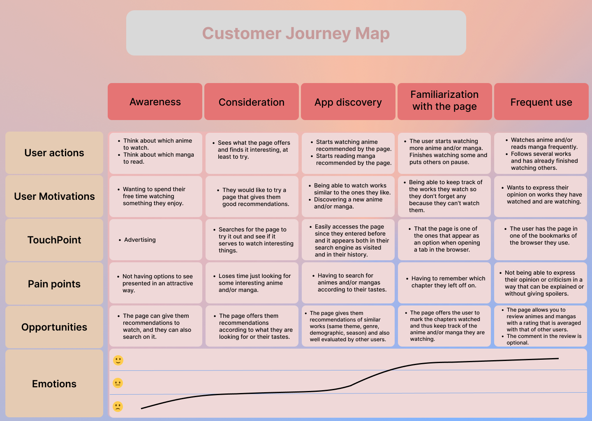

# Hootaku-UX-2023-

UX study for Hootaku, an application for tracking of anime-related media.

Team 4:
- Alfredo Ávila — Designer
- César Astudillo  — Designer
- Fernando Fernández — Designer
- Francisco Tropa — Designer

## Index

- [1. Introduction](#1-introduction)
- [2. Strategy](#2-strategy)
- [3. UX Person](#3-ux-person)
- [4. Benchmark](#4-benchmark)
- [5. Customer Journey Map](#5-customer-journey-map)
- [6. Navigation](#6-navigation)
  - [6.1. Initial Approach](#61-initial-approach)
  - [6.2. Improved Navigation](#62-improved-navigation)
- [7. Wireframes](#7-wireframes)
- [8. Mockups](#8-mockups)
  - [8.1. Initial Aproach](#81-initial-approach)
  - [8.2. Improved Mockups](#82-improved-mockups)

---

## 1. Introduction

Consuming anime and manga has become a more mainstream hobby in recent years, but with the rise of the medium, finding exciting new stories andd tracking the chapters and episodes of a particular series is becoming increasingly difficult among the sea of content available.

This project is focused on automatizing this aspect of the hobby in an approachable and simplified manner.

---

## 2. Strategy

To have a more structured plan for the project, we have used a 'Value proposition canvas', so our view is focused and has a solid foundation.

In this canvas we analyze the problems our application is tackling, how we will approach said problems, and a strategical analyisis of the required functions we will need. 

---

## 3. UX Person

//Pending

---

## 4. Benchmark

//Pending

---

## 5. Customer Journey Map

//Pending

---

## 6. Navigation

//Pending

### 6.1. Initial Approach

### 6.2. Improved Navigation

---

## 7. Wireframes

//Pending

---

## 8. Mockups

//Pending

### 8.1. Initial Approach

//Pending

### 8.2. Improved Mockups

//Pending

---
